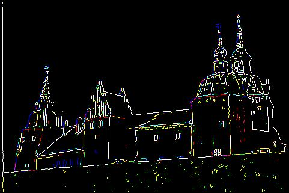

Canny Edge Detector
====================

In this project, I have implemented Canny Edge Detector on MATLAB.

Canny edge detector uses the following methods to compute the edges:

- Finding gradients of image in x and y directions and calculating the magnitude and orientation matrices.
- Performing Non-Maximum Suppression to find local maxima in the magnitude of the image by interpolating the magnitude values using orientation values.
- Using Hysteresis Edge Linking to link edges and to remove outliers.

# Results

|  Image | Edges |
| ----------- | ----------- |
|  |  |
|  |  |
|  |  |